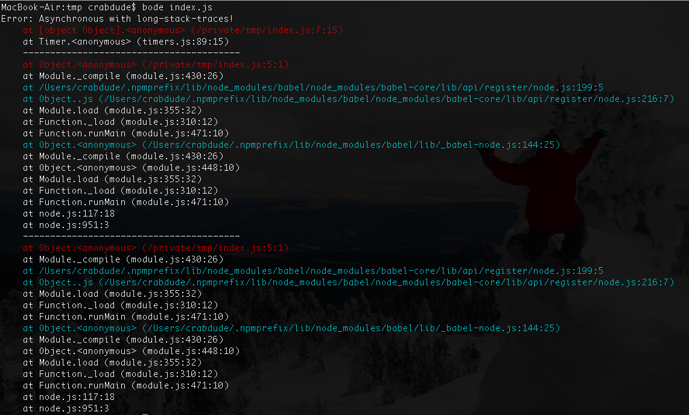

class: center, middle

# Async/Await 

Simpler asynchronous JavaScript programming.

---

# Overview

**3 mechanisms of asynchronous programming:**

1. Callbacks

  ```javascript
  fs.readFile(__filename, (err data) => { /* ... */ })
  ```
1. Promises

  ```javascript
  // Using pn
  fs.readFile(__filename)
      .then(data => { /* ... */ })
      .catch(err => { /* ... */ })
  ```
1. Async/Await

  ```javascript
  // Within a function marked `async`
  let data = fs.readFile(__filename)
  ```

---

# Why not use callbacks?

**Simplest in concept, manual and erorr-prone in practice.**

```javascript
function myStatDir(dirPath, callback) {
    fs.stat(dirPath, (err, stats) => {
        // Remember to pass error and early return
        if (err) return callback(err)

        // Remember to call callback
        callback(null, stats)
    })
}
```

---

# Why not use callbacks?

**Errors cannot be caught! (without monkey-patching the runtime)**

```javascript
// This will crash your server
try {
    statDir(__dirname, (err, stats) => {
        throw new Error('Boom.')
    })
} catch(err) {
    // Nope.
}
```

---

# Why not use callbacks?

**The pyramid of doom**

```javascript
foo((err, a) => {
    if (err) return callback(err)
    bar(a, (err, b) => {
        if (err) return callback(err)
        baz(b, (err, c) => {
            if (err) return callback(err)
            // Uhh.....
        })
    })
})
```

---

# Why not use callbacks?

**Even simple control-flows require complex non-standardized libraries**

```javascript
async.waterfall([
    (callback) => {
        callback(null, 'foo')
    },
    (callback, foo) => {
        callback(null, 'bar')
    },
    (callback, bar) => {
        callback(null, 'baz')
    }
], (err, baz) => {
    console.log(baz)
})
```

---

# What about `Promise`?

**Better...**

```javascript
function statDir(dirPath) {
    // With pn/fs
    return fs.stat(dirPath)
}

function statDir(dirPath) {
    // With songbird
    return fs.promise.stat(dirPath)
}
```

*Note: `pn` is only for CORE APIs*

*Note: `songbird` provides compatibility with ANY callback API

---

# What about `Promise`?

**Better...**


  
---

# What about `Promise`?

**Better...**
- Included in language: ES6, node v0.11.13, io.js v1.0


  
---

# What about `Promise`?

**Better...**
- Included in language: ES6, node v0.11.13, io.js v1.0
- Automatic error handling and propagation


  
---

# What about `Promise`?

**Better...**
- Included in language: ES6, node v0.11.13, io.js v1.0
- Automatic error handling and propagation
- Elegant chaining for control-flow


  
---

# What about `Promise`?

**Better...**
- Included in language: ES6, node v0.11.13, io.js v1.0
- Automatic error handling and propagation
- Elegant chaining for control-flow
- Expectations are guaranteed in spec:


  
---

# What about `Promise`?

**Better...**
- Included in language: ES6, node v0.11.13, io.js v1.0
- Automatic error handling and propagation
- Elegant chaining for control-flow
- Expectations are guaranteed in spec:
  - Call only once


  
---

# What about `Promise`?

**Better...**
- Included in language: ES6, node v0.11.13, io.js v1.0
- Automatic error handling and propagation
- Elegant chaining for control-flow
- Expectations are guaranteed in spec:
  - Call only once
  - Pass real errors


  
---

# What about `Promise`?

**Better...**
- Included in language: ES6, node v0.11.13, io.js v1.0
- Automatic error handling and propagation
- Elegant chaining for control-flow
- Expectations are guaranteed in spec:
  - Call only once
  - Pass real errors
  - Pass only error or result

  
---

# What about `Promise`?

**Better...**
- Included in language: ES6, node v0.11.13, io.js v1.0
- Automatic error handling and propagation
- Elegant chaining for control-flow
- Expectations are guaranteed in spec:
  - Call only once
  - Pass real errors
  - Pass only error or result
- **Still very confusing for beginners**
  
---

# What about `Promise`?

**Promise Constructor**

```javascript
// Useful for complex or atypical flows
function wait(time) {
    return new Promise((resolve, reject) => {
        // setTimeout is not an err-back
        setTimeout(resolve, time)
    })
}
```

---

# What about `Promise`?

**Promise Constructor**

```javascript
// Or compatibility with callback APIs
function statDir(dirPath) {
    return new Promise((resolve, reject) => {
        fs.stat(dirPath, (err, stat) => {
            if (err) return reject(err)
            resolve(stat)
        })
    })
}
```

---

# What about `Promise`?

**Problem: Errors can silently fail!**

```javascript
// You won't know this threw
statDir(__dirname)
    .then(stats => {
        throw new Error('Boom.')
    })
    .then(someValue => {
        // Nope.
    })
```

---

# What about `Promise`?

**Simple control-flows are supported, but still not obvious**

```javascript
foo()


.
```

---

# What about `Promise`?

**Simple control-flows are supported, but still not obvious**

```javascript
foo()
    .then(a => {
   
    })
 
 
 
 
 
.
```

---

# What about `Promise`?

**Simple control-flows are supported, but still not obvious**

```javascript
foo()
    .then(a => {
        return bar(a)
    })


.
```

---

# What about `Promise`?

**Simple control-flows are supported, but still not obvious**

```javascript
foo()
    .then(a => {
        return bar(a)
    })
    .then(bar => {

    })


.
```

---

# What about `Promise`?

**Simple control-flows are supported, but still not obvious**

```javascript
foo()
    .then(a => {
        return bar(a)
    })
    .then(bar => {
        return baz(c)
    })


.
```

---

# What about `Promise`?

**Simple control-flows are supported, but still not obvious**

```javascript
foo()
    .then(a => {
        return bar(a)
    })
    .then(bar => {
        return baz(c)
    })
    .then(result => console.log(result))

.
```

---

# What about `Promise`?

**Simple control-flows are supported, but still not obvious**

```javascript
foo()
    .then(a => {
        return bar(a)
    })
    .then(bar => {
        return baz(c)
    })
    .then(result => console.log(result))
    // ALWAYS remember to check for errors!
    .catch(e => console.log(e.stack))
```

---

# `async/await`

**Our hero!* **

```javascript
async main() => {
    let a = await foo()


}


main()


.
```

* *Available in ES7 and Babel.js*

---

# `async/await`

**Our hero!* **

```javascript
async main() => {
    let a = await foo()
    let b = await bar(a)
    let c = await baz(b)
    return result
}


main()


.
```

* *Available in ES7 and Babel.js*

---

# `async/await`

**Our hero!* **

```javascript
async main(someArg) => {
    let a = await foo(someArg)
    let b = await bar(a)
    let c = await baz(b)
    return result
}


main(someArg)


.
```

* *Available in ES7 and Babel.js*

---

# `async/await`

**Our hero!* **

```javascript
async main(someArg) => {
    let a = await foo(someArg)
    let b = await bar(a)
    let c = await baz(b)
    return result
}


main(someArg)


.
```

* *Available in ES7 and Babel.js*

---

# `async/await`

**Our hero!* **

```javascript
async main(someArg) => {
    let a = await foo(someArg)
    let b = await bar(a)
    let c = await baz(b)
    return result
}


main(someArg)
    .then(result => console.log(result))


.
```

* *Available in ES7 and Babel.js*

---

# `async/await`

**Our hero!* **

```javascript
async main(someArg) => {
    let a = await foo(someArg)
    let b = await bar(a)
    let c = await baz(b)
    return result
}


main(someArg)
    .then(result => console.log(result))
    .catch(e => console.log(e.stack))

.
```

* *Available in ES7 and Babel.js*

---

# `async/await`

**Our hero!* **

```javascript
async main(someArg) => {
    let a = await foo(someArg)
    let b = await bar(a)
    let c = await baz(b)
    return result
}

async ()=> {

    let result = await main(someArg)


}()
```

* *Available in ES7 and Babel.js*

---

# `async/await`

**Our hero!* **

```javascript
async main(someArg) => {
    let a = await foo(someArg)
    let b = await bar(a)
    let c = await baz(b)
    return result
}

async ()=> {
    try {
        let result = await main(someArg)
    } catch(e) {
        console.log(e.stack)
    }
}()
```

* *Available in ES7 and Babel.js*

---

# `async/await`

**Synchronous-style Parallel IO**

```javascript
async function main(someArg) {
    // Wait on foo, bar and baz in parallel
    let [a, b, c] = await Promise.all([foo(someArg), bar(), baz()])
    return a + b + c
}
```

---

# `async/await`

**Await on Non-Promise values**

```javascript
async function main(someArg) {
    // Wait on foo, bar and baz in parallel
    let [a, b, c] = await Promise.all([foo(someArg), bar(), baz()])
    return a + b + c
}
```

*Note: It's intentional that the code above is the same!*

---

class: center, middle

# Why is `async/await` SUPER AWESOME?!

---

class: center, middle

# It forces a distinction between synchronous and asynchronous functions!

---

# `async/await`

**To review, Lifecycle Phases:**
- Require Phase

---

# `async/await`

**To review, Lifecycle Phases:**
- Require Phase
  - Blocking `*Sync` IO acceptable

---

# `async/await`

**To review, Lifecycle Phases:**
- Require Phase
  - Blocking `*Sync` IO acceptable
  - Must be completed by end of the main tick

---

# `async/await`

**To review, Lifecycle Phases:**
- Require Phase
  - Blocking `*Sync` IO acceptable
  - Must be completed by end of the main tick
  - E.g., `require('fs')`, etc...

---

# `async/await`

**To review, Lifecycle Phases:**
- Require Phase
  - Blocking `*Sync` IO acceptable
  - Must be completed by end of the main tick
  - E.g., `require('fs')`, etc...
- Configure Phase

---

# `async/await`

**To review, Lifecycle Phases:**
- Require Phase
  - Blocking `*Sync` IO acceptable
  - Must be completed by end of the main tick
  - E.g., `require('fs')`, etc...
- Configure Phase
  - The phase between blocking IO and async IO

---

# `async/await`

**To review, Lifecycle Phases:**
- Require Phase
  - Blocking `*Sync` IO acceptable
  - Must be completed by end of the main tick
  - E.g., `require('fs')`, etc...
- Configure Phase
  - The phase between blocking IO and async IO
  - Typically, used to construct objects

---

# `async/await`

**To review, Lifecycle Phases:**
- Require Phase
  - Blocking `*Sync` IO acceptable
  - Must be completed by end of the main tick
  - E.g., `require('fs')`, etc...
- Configure Phase
  - The phase between blocking IO and async IO
  - Typically, used to construct objects
  - E.g., `http.createServer(..)`

---

# `async/await`

**To review, Lifecycle Phases:**
- Require Phase
  - Blocking `*Sync` IO acceptable
  - Must be completed by end of the main tick
  - E.g., `require('fs')`, etc...
- Configure Phase
  - The phase between blocking IO and async IO
  - Typically, used to construct objects
  - E.g., `http.createServer(..)`
- Initialize Phase

---

# `async/await`

**To review, Lifecycle Phases:**
- Require Phase
  - Blocking `*Sync` IO acceptable
  - Must be completed by end of the main tick
  - E.g., `require('fs')`, etc...
- Configure Phase
  - The phase between blocking IO and async IO
  - Typically, used to construct objects
  - E.g., `http.createServer(..)`
- Initialize Phase
  - Async IO only

---

# `async/await`

**To review, Lifecycle Phases:**
- Require Phase
  - Blocking `*Sync` IO acceptable
  - Must be completed by end of the main tick
  - E.g., `require('fs')`, etc...
- Configure Phase
  - The phase between blocking IO and async IO
  - Typically, used to construct objects
  - E.g., `http.createServer(..)`
- Initialize Phase
  - Async IO only
  - E.g., `await http.promise.listen(8000)`

---

# `async/await`

**To review, Lifecycle Phases:**
- Require Phase
  - Blocking `*Sync` IO acceptable
  - Must be completed by end of the main tick
  - E.g., `require('fs')`, etc...
- Configure Phase
  - The phase between blocking IO and async IO
  - Typically, used to construct objects
  - E.g., `http.createServer(..)`
- Initialize Phase
  - Async IO only
  - E.g., `await http.promise.listen(8000)`
- Running Phase

---

# `async/await`

**To review, Lifecycle Phases:**
- Require Phase
  - Blocking `*Sync` IO acceptable
  - Must be completed by end of the main tick
  - E.g., `require('fs')`, etc...
- Configure Phase
  - The phase between blocking IO and async IO
  - Typically, used to construct objects
  - E.g., `http.createServer(..)`
- Initialize Phase
  - Async IO only
  - E.g., `await http.promise.listen(8000)`
- Running Phase
  - Ready to receive requests, respond to external events, etc...

---

# `async/await`

**To review, Lifecycle Phases:**
- Require Phase
  - Blocking `*Sync` IO acceptable
  - Must be completed by end of the main tick
  - E.g., `require('fs')`, etc...
- Configure Phase
  - The phase between blocking IO and async IO
  - Typically, used to construct objects
  - E.g., `http.createServer(..)`
- Initialize Phase
  - Async IO only
  - E.g., `await http.promise.listen(8000)`
- General Phase
  - Ready to receive requests, respond to external events, etc...
  - E.g., `app.get('*', routeHandler)`

---

# `async/await`

**Separation of Async and Sync lifecycle phases**

```javascript
async main(someArg) => {

    let a = await foo(someArg)
    let b = await bar(a)
    let c = await baz(b)
    return result
}


async ()=> {
    try {
        let result = await main(someArg)
    } catch(e) {
        console.log(e.stack)
    }
}()
```

---

# `async/await`

**Separation of Async and Sync lifecycle phases**

```javascript
async main(someArg) => {
    // General Phase
    let a = await foo(someArg)
    let b = await bar(a)
    let c = await baz(b)
    return result
}


async ()=> {
    try {
        let result = await main(someArg)
    } catch(e) {
        console.log(e.stack)
    }
}()
```

---

# `async/await`

**Separation of Async and Sync lifecycle phases**

```javascript
// index.js
// Require Phase
let main = require('./main')


async ()=> {
    try {
        let result = await main(someArg)
    } catch(e) {
        console.log(e.stack)
    }
}()
```

---

# `async/await`

**Separation of Async and Sync lifecycle phases**

```javascript
// index.js
// Require Phase
let main = require('./main')


// Initialize Phase
main(someArg).catch(err => console.log(err.stack))
```

---

# `async/await`

**Separation of Async and Sync lifecycle phases**

```javascript
// index.js
// Require Phase
let main = require('./main')

// Configure Phase
process.on('uncaughtException', function(err) {
    console.log('uncaughtException: \n\n', err.stack)
    // IMPORTANT! (optionally, soft exit)
    process.exit()
})


// Initialize Phase
main(someArg).catch(err => console.log(err.stack))
```

---

# `async/await`

**Separation of Async and Sync lifecycle phases**

```javascript
// index.js
// Require Phase
let main = require('./main')

// Configure Phase
process.on('uncaughtException', function(err) {
    console.log('uncaughtException: \n\n', err.stack)
    // IMPORTANT! (optionally, soft exit)
    process.exit()
})

process.on('unhandledRejection', (err, rejectedPromise) => {
    console.log('unhandledRejection: \n\n', err.stack)
})

// Initialize Phase
main(someArg).catch(err => console.log(err.stack))
```

---

# `async/await`

**Separation of Async and Sync lifecycle phases**

```javascript
// index.js
// Require Phase
let app = require('./app')

// Configure Phase
process.on('uncaughtException', function(err) {
    console.log('uncaughtException: \n\n', err.stack)
    // IMPORTANT! (optionally, soft exit)
    process.exit()
})

process.on('unhandledRejection', (err, rejectedPromise) => {
    console.log('unhandledRejection: \n\n', err.stack)
})

// Initialize Phase
app.initialize().catch(err => console.log(err.stack))
```

---

# `async/await`

**Even safer with `trycatch`**

```javascript
// index.js
// Require Phase
let app = require('./app')


// Initialize Phase
app.initialize().catch(err => console.log(err.stack))
```

---

# `async/await`

**Even safer with `trycatch`**

```javascript
// index.js
// Require Phase
let app = require('./app')
require('trycatch')


// Initialize Phase
app.initialize().catch(err => console.log(err.stack))
```

---

# `async/await`

**Even safer with `trycatch`**

```javascript
// index.js
// Require Phase
let app = require('./app')
require('trycatch')

// Configure Phase
process.on('uncaughtException', handleErrorAndExit)
process.on('unhandledRejection', handleError)


// Initialize Phase
app.initialize().catch(err => console.log(err.stack))
```

---

# `async/await`

**Even safer with `trycatch`**

```javascript
// index.js
// Require Phase
let app = require('./app')
require('trycatch')

// Configure Phase
process.on('uncaughtException', handleErrorAndExit)
process.on('unhandledRejection', handleError)
process.on('unhandledApplicationException', handleError)


// Initialize Phase
app.initialize().catch(err => console.log(err.stack))
```

---

# `async/await`

**`trycatch` also supports long-stack-traces**

```javascript
// index.js
// Require Phase
let app = require('./app')
let trycatch = require('trycatch')

// Configure Phase
process.on('uncaughtException', handleErrorAndExit)
process.on('unhandledRejection', handleError)
process.on('unhandledApplicationException', handleError)

if (process.env.NODE_ENV === 'development') {
    trycatch.configure({'long-stack-traces'})
}


// Initialize Phase
app.initialize().catch(err => console.log(err.stack))
```

---

# `async/await`

**`trycatch` also supports long-stack-traces**



---

# `async/await`

**Using `async/await` today with Async Generators (`function*()/yield`)**

- Support today in node v0.11.13, io.js v1.0 with a library like `bluebird`

```javascript
function* main(someArg) {
  let a = yield foo(someArg)
  let b = yield bar(a)
  let c = yield baz(b)
  return result
}
bluebird.coroutine(function*() {
  try {
    let result = yield main()
  } catch(e) {
    console.log(e.stack)
  }
})
```

---

class: center, middle

# Questions?
