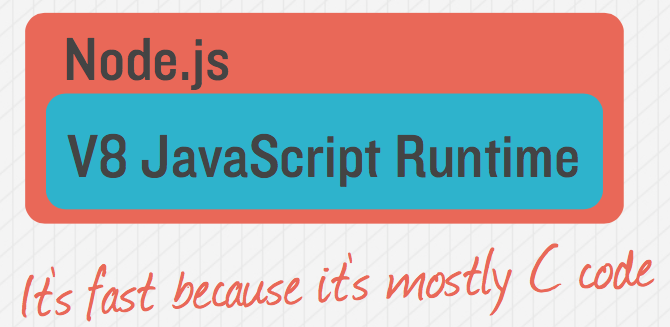
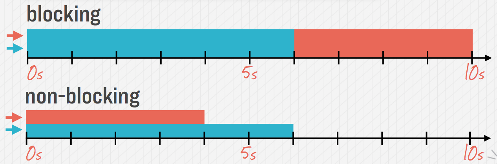

class: center, middle

# Intro to Ndoe.js

The V8 non-blocking asynchronous JavaScript runtime.

---

# What is Node.js?

**A set of non-blocking IO bindings for the V8 JavaScript VM**



---

# Why Node.js?

**To build scalable network applications using JavaScript on the server**

* Non-block asynchronous IO APIs
* IO-bound applications
* Use the Language of the Web, JavaScript 
* Scripting for faster front-end development 

---

# What could you build?

**Anything that's not CPU-bound:**

* Websocket Server (e.g., chat server)
* Fast File Upload Server/Client
* Ad/Metric Server
* Any Realtime Application
* Tooling CLIs
* API server (e.g., Mobile back-end)

---

# Node.js Core

**Core is low-level:**

* Strives to be small
* No Web Framework
* No convenience utilities
* No multi-threading
* No control-flow

---

# Blocking vs Non-Blocking

**Blocking Code:**

```
Read file from Filesystem, set equal to "data"
Print data
Do something else
```

**Non-Blocking Code:**

```
Read file from Filesystem
    // This is a callback
    On completion, print "data"
Do something else
```

---

# Blocking vs Non-Blocking

**Blocking Code:**

```node
// BAD
let data = fs.readFileSync('~/.bashrc')
console.log(data)
doSomethingElse()
```

**Non-Blocking Code:**

```node
// GOOD (using promises)
fs.readFile('~/.bashrc')
    .then(data => console.log(data))
doSomethingElse()
```

---

# Non-Blocking with Async/Await

**Use `async` function and `await` instead:**

```node
// BEST
async()=>{
  let data = fs.readFile('~/.bashrc')
  console.log(data)
}()
doSomethingElse()
```

---

# Blocking vs Non-Blocking

```node
async()=>{
  let datas = await Promise.all([
    fs.readFile('~/.bashrc'),
    fs.readFile('~/.bash_profile')
  ])
  console.log(datas)
}()
```



---

class: center, middle

# Questions?
